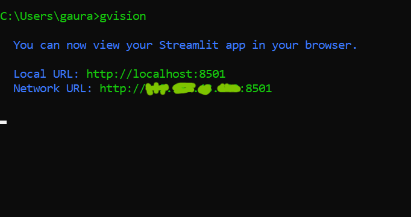
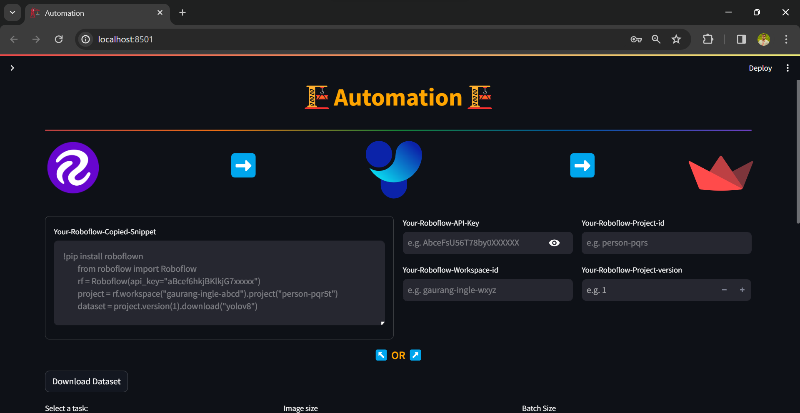

# GVISION

GVISION is a streamlined solution for vision tasks, including data collection from Roboflow, model training with Ultralytics, and deployment demos using Streamlit.

## Features

- **Roboflow Integration**: Easily download datasets from Roboflow for your computer vision projects.
- **Ultralytics Model Training**: Train your custom models using Ultralytics, with support for various tasks such as object detection, segmentation, classification, and pose estimation.
- **Streamlit Deployment Demo**: Quickly deploy your trained models with Streamlit for interactive demos and visualization.

## Installation

You can install GVISION using pip:

```bash
>>>pip install gvision
```
# Global CLI
```bash
>>>gvision
```



